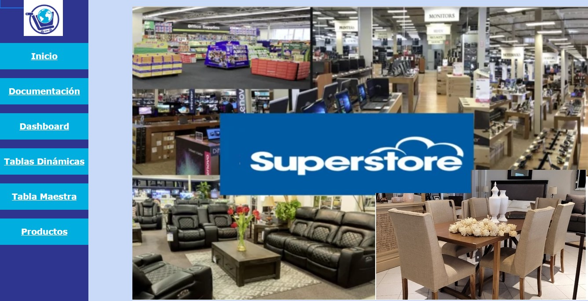
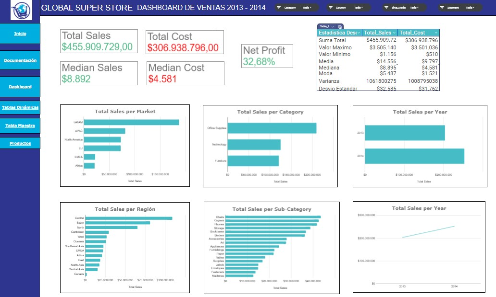

DAM1-PI1-Products-Global-Super-Store

Proyecto de Análisis de Datos de Super Tienda Global

Este proyecto tiene como objetivo realizar un análisis exhaustivo y dinámico de los datos proporcionados por la empresa "Super Tienda Global", utilizando herramientas como Google Sheets para la limpieza y preparación de datos, así como funciones de análisis dinámico y la creación de un Dashboard Interactivo

  

1° Avance: Conociendo y Preparando los Datasets:

En el primer avance, se trabajó en la importación y limpieza de los datos provenientes de los archivos Master Global Super Store y Products Global Super Store. Esta fase consistió en ordenar y validar los datos, identificar valores faltantes o erróneos, y asignarles el formato adecuado. Además, se documentaron las variables y se generaron nuevas columnas cuando fue necesario.

2° Avance: Análisis Dinámico con Fórmulas y Tablas:

En el segundo avance, el análisis se enfocó en la creación de métricas y el uso de fórmulas y tablas dinámicas para responder a diversas consultas comerciales. Se crearon resúmenes de ventas por categorías, mercados, sub-categorías, y otros factores clave, y se utilizaron funciones condicionales y de búsqueda para obtener resultados precisos. Este análisis permitió identificar las tendencias del negocio y las métricas que facilitarían la toma de decisiones.

3° Avance: Análisis Dinámico y Dashboard Interactivo:

En el tercer avance, se realizó un análisis estadístico y se crearon gráficos dinámicos para visualizar de manera clara los datos clave. Los gráficos incluyeron ventas por categorías, mercados, regiones y otros, y se diseñó un Dashboard interactivo con segmentadores para una navegación eficiente. El objetivo era proporcionar una herramienta visual que facilitara la interpretación de los datos y soportara la toma de decisiones estratégicas de la empresa.

En resumen, el proyecto buscó transformar los datos en información útil mediante un proceso de limpieza, análisis dinámico y visualización interactiva, con el fin de mejorar la toma de decisiones y ofrecer una comprensión más profunda del comportamiento del negocio.

  

Requisitos Técnicos
Herramientas Utilizadas:

• Google Sheets para la limpieza y análisis de datos.

• Tablas dinámicas para el análisis de grandes volúmenes de información.

• Funciones avanzadas de Google Sheets para manipulación de datos.

• Gráficos dinámicos para visualización efectiva de los resultados.
